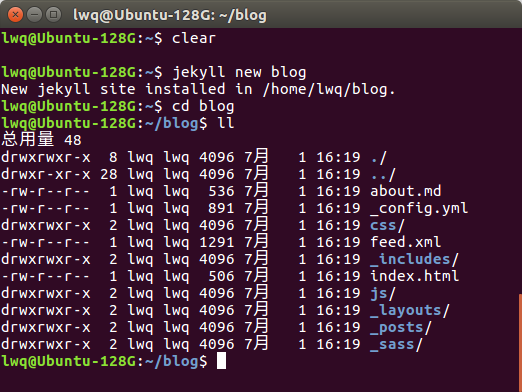
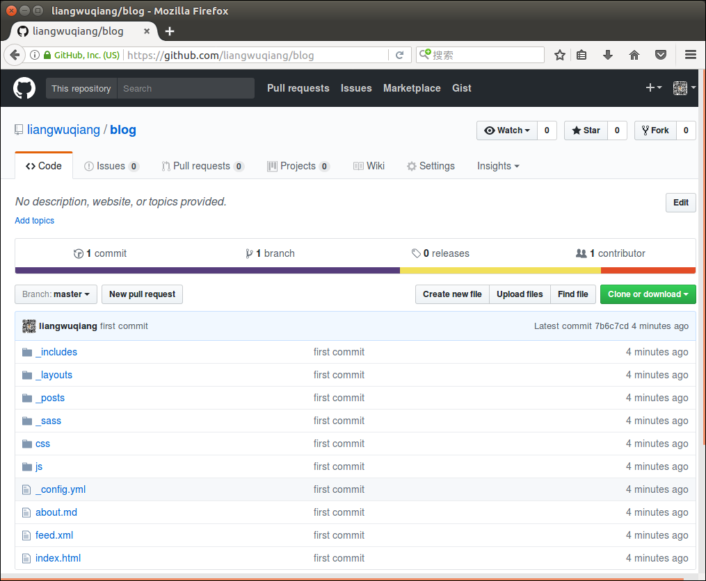
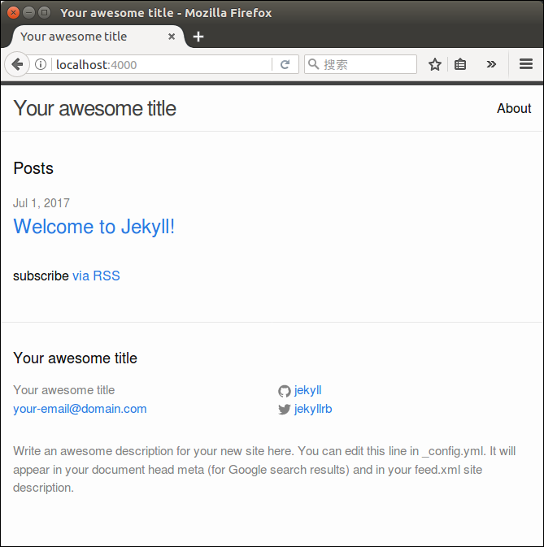
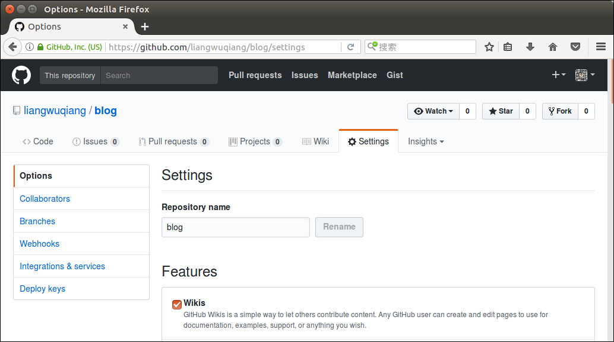
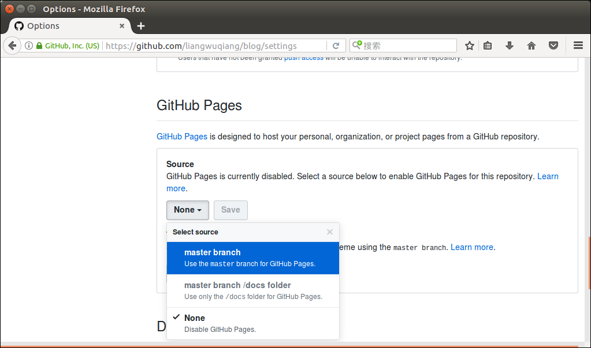
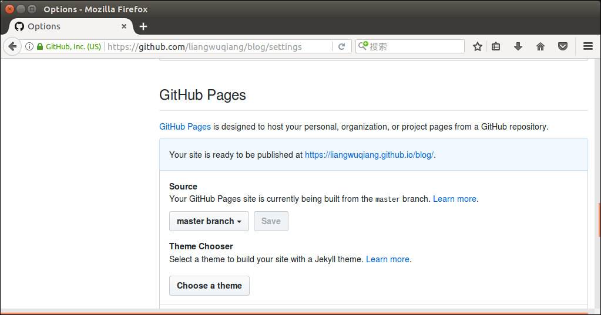
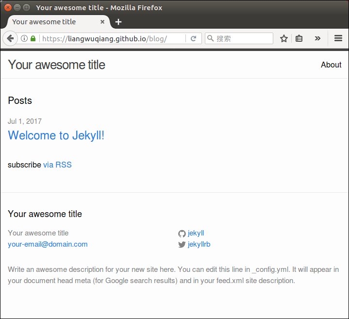

> 本文参考：[http://jekyllcn.com/](http://jekyllcn.com/);  [https://github.com/](https://github.com/)

## 1.搭建jeckyll环境

    1. sudo apt install ruby  //安装ruby
    
    2. sudo gem install jekyll
    
    3. sudo apt install jekyll  //安装jekyll
    
    4. jekyll new blog  //创建新的项目blog
    
    5. cd blog

## 2.建立仓库并推送到网上

    6. git init  //创建git仓库
    
    7. git add . //往仓库中添加所用文件
    
    8. git commit -m "first commit"  //提交到本地仓库
    
    9. 在Github上创建一个空的仓库blog
    
    10. 复制链接 git@github.com:liangwuqiang/blog.git
    
    11. git remote add origin git@github.com:liangwuqiang/blog.git 
        //将链接指定为origin
    
    12. git push -u origin master 
        //本地仓库的master分支推送到网上和origin对应的链接上，并关联好，以便以后直接使用

## 3.本地调试

    13. jekyll server
    
    14. 在浏览器中输入网址：http://localhost:4000

## 4.网上效果

    15. 进入仓库 https://github.com/liangwuqiang/blog
    
    16. 点击 Settings=>GitHub Pages=>Source=>Select source=>master branch=>Save

    17. 此时上一行出现了链接 https://liangwuqiang.github.io/blog/

    18. 进入链接

(End)

