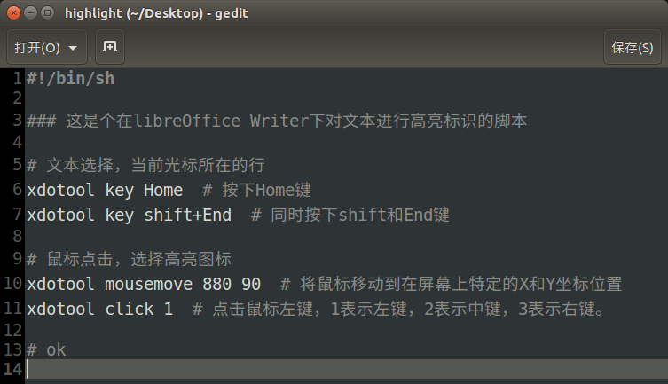
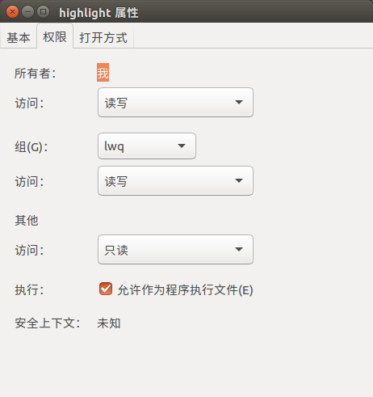
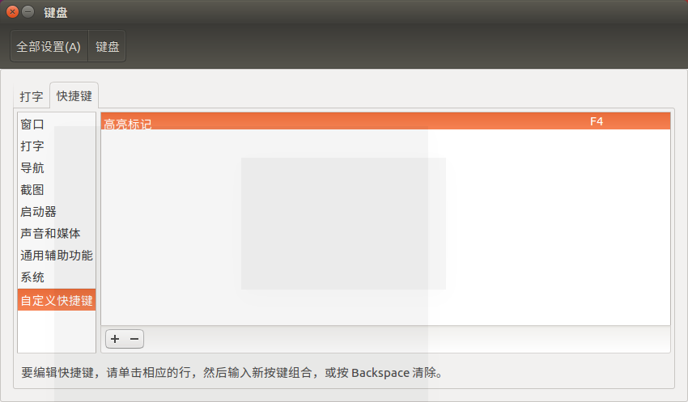
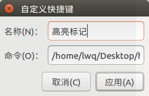
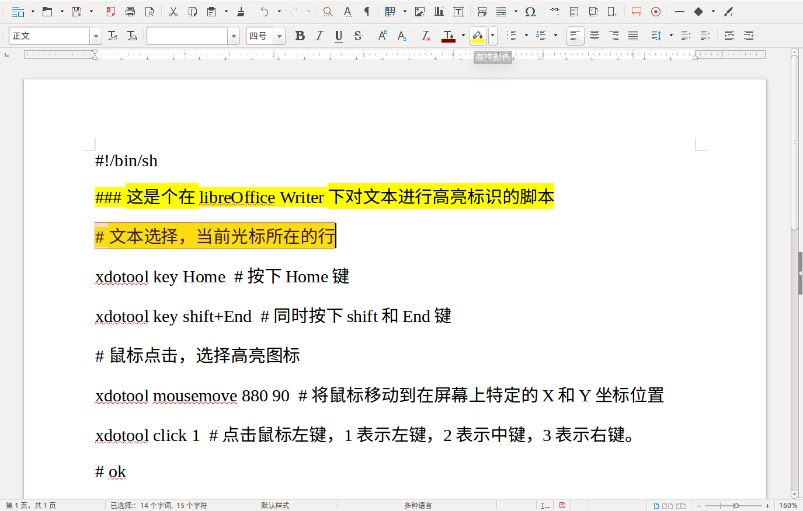

## 1.安装xdotool

sudo apt install xdotool

## 2.脚本文件

## 3.使文件可运行

或 chmod +x highlight

## 4.关联快捷键

/home/lwq/Desktop/highlight

## 5.实际效果

## 6.脚本源代码

    
    
    #!/bin/sh
    
    ### 这是个在libreOffice Writer下对文本进行高亮标识的脚本
    
    # 文本选择，当前光标所在的行
    xdotool key Home  # 按下Home键
    xdotool key shift+End  # 同时按下shift和End键
    
    # 鼠标点击，选择高亮图标
    xdotool mousemove 880 90  # 将鼠标移动到在屏幕上特定的X和Y坐标位置
    xdotool click 1  # 点击鼠标左键，1表示左键，2表示中键，3表示右键
    
    # ok
    

