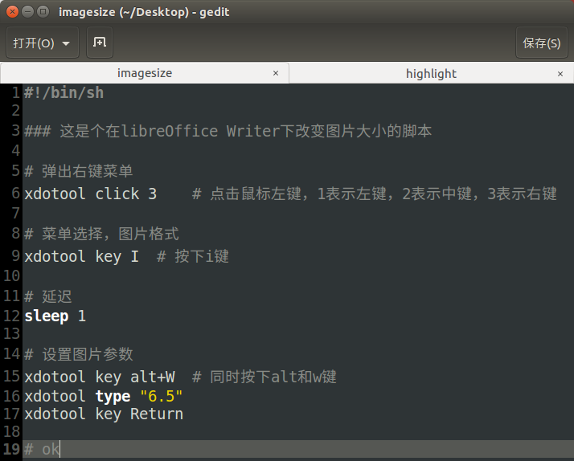

## 1.与上篇类似部分不重复了

2017-07-03-在LibreOffice中做高亮标记.md

## 2.脚本文件

## 3.脚本源代码

    
    #!/bin/sh
    
    ### 这是个在libreOffice Writer下改变图片大小的脚本
    
    # 弹出右键菜单
    xdotool click 3    # 点击鼠标左键，1表示左键，2表示中键，3表示右键
    
    # 菜单选择，图片格式
    xdotool key I  # 按下i键
    
    # 延迟
    sleep 1
    
    # 设置图片参数
    xdotool key alt+W  # 同时按下alt和w键
    xdotool type "6.5"
    xdotool key Return
    
    # ok
    

